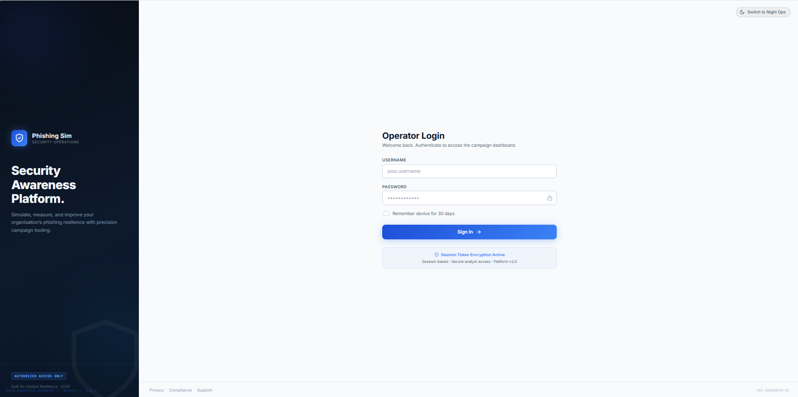
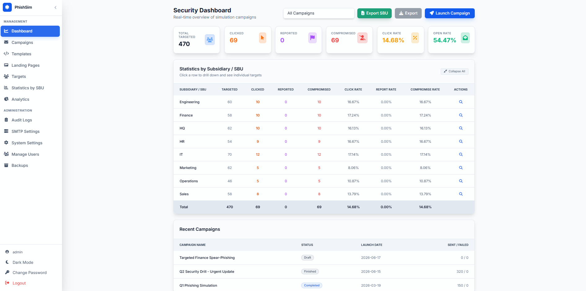
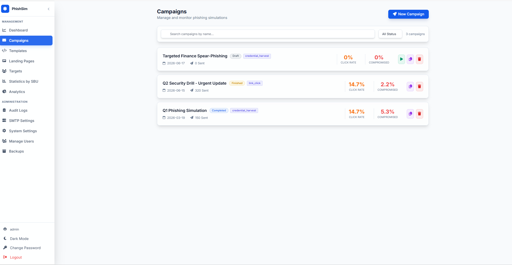

# PhishSim - Open Source Phishing Simulation Platform

## 📖 Background & Purpose
**PhishSim!** is a flexible, open-source phishing simulation tool designed to help teams run internal security awareness campaigns. Built as a cost-effective alternative to expensive commercial solutions, it provides core features to track email opens, monitor link clicks, safely simulate credential harvesting for training, and educate users.

## 📸 Application Overview

### Login Page

The secure entry point for administrators to access the phishing platform. It protects sensitive simulation data, target lists, and campaign results from unauthorized access.

### Dashboard

The Dashboard provides a high-level overview of all phishing activity. You can see real-time statistics on emails sent, opened, clicked, and compromised, giving you an immediate picture of your organisation's security posture and awareness levels.

### Campaigns

The control center for creating and managing your phishing tests. Here you can draft new simulations, select email templates, choose target departments, and review the detailed results of past and active campaigns.

## 🚀 How to Set Up the App

It's designed to be incredibly easy to run locally or on a basic server.

1. **Clone the repository** and navigate into the project folder.
2. **Create a virtual environment and install dependencies:**
   *Windows (PowerShell):*
   ```powershell
   python -m venv .venv
   .\.venv\Scripts\Activate.ps1
   pip install -r requirements.txt
   ```
   *Linux/Mac:*
   ```bash
   python3 -m venv .venv
   source .venv/bin/activate
   pip install -r requirements.txt
   ```
3. **Run the application:**
   ```powershell
   .\start.bat
   ```
   *(Or run `python run_production.py` directly)*
4. **Access the web interface** at `http://127.0.0.1:8083`
5. **Default Login:**
   - **Username**: `admin`
   - **Password**: `admin123`
   *(Make sure to change these in `config.py` for a real production deployment!)*

## 🎯 How to Conduct a Campaign

Running a successful phishing simulation only takes a few steps:

1. **Configure SMTP**: Go to the **Settings** page and configure your SMTP profile with your mail server details so the application can send emails.
2. **Create a Landing Page**: Go to **Landing Pages** to design the fake login or educational page where users will end up if they click the link in your email.
3. **Design Email Template**: Go to **Templates** and write the phishing email in the WYSIWYG editor. Use placeholders like `{{link}}` to ensure clicks are tracked and routed to your landing page.
4. **Add Targets**: Navigate to **Targets** and upload or manually enter the employees/departments you want to test.
5. **Launch Campaign**: Go to **Campaigns -> Create New**. Give it a name, select your targets, choose your email template and landing page, and hit Start!
6. **Monitor Results**: Watch the **Dashboard** in real-time as users open emails, click links, or submit data. The results will help you identify which departments need more security training.

## ⚙️ Configuration Options

Advanced configurations can be made by editing `config.py` or by using environment variables. 
The application defaults to a local SQLite database (`campaigns.db`) out-of-the-box for easy testing.

Enjoy testing and improving your organisation's security!
